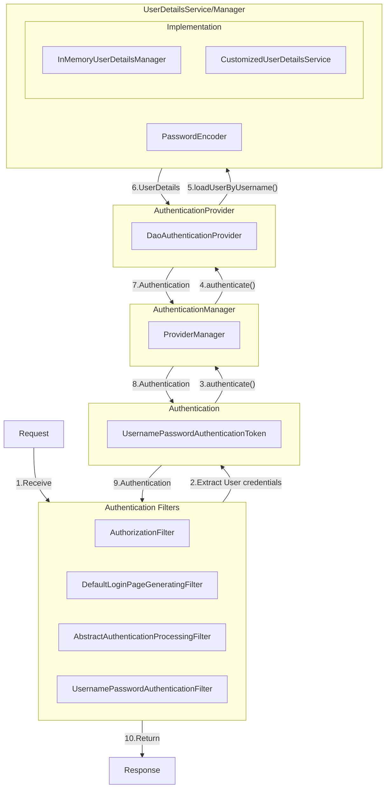

# spring-security-template

```mermaid
flowchart
%% Requests & Responses
    Request
    Response
%% Authentication Filters grouping
    subgraph Filters["Authentication Filters"]
        AuthorizationFilter
        DefaultLoginPageGeneratingFilter
        AbstractAuthenticationProcessingFilter
        UsernamePasswordAuthenticationFilter
    end

%% Authentication token
    subgraph Authentication
        UsernamePasswordAuthenticationToken
    end

%% Authentication manager
    subgraph AuthenticationManager
        ProviderManager
    end

%% Authentication provider
    subgraph AuthenticationProvider
        DaoAuthenticationProvider
    end

%% UserDetailsService
    subgraph UserDetailsService/Manager
        subgraph Implementation
            InMemoryUserDetailsManager
            CustomizedUserDetailsService
        end
        PasswordEncoder
    end

%% Flow steps
    Request -->|" 1.Receive "| Filters
    Filters -->|" 2.Extract User credentials "| Authentication
    Authentication -->|" 3.authenticate() "| AuthenticationManager
    AuthenticationManager -->|" 4.authenticate() "| AuthenticationProvider
    AuthenticationProvider -->|" 5.loadUserByUsername() "| UserDetailsService/Manager
    UserDetailsService/Manager -->|" 6.UserDetails "| AuthenticationProvider
    AuthenticationProvider -->|" 7.Authentication "| AuthenticationManager
    AuthenticationManager -->|" 8.Authentication "| Authentication
    Authentication -->|" 9.Authentication "| Filters
    Filters -->|" 10.Return "| Response

```