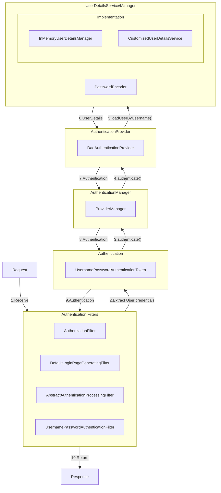

# Spring Security Authentication Process

This document illustrates and explains how Spring Security handles an incoming authentication
request—from the moment the HTTP request enters the filter chain to when a fully authenticated
Authentication object is stored in the security context.

## Diagram

## Authentication Flow Steps

1. **Receive**  
   The incoming `HttpServletRequest` is intercepted by the security filter chain.

2. **Extract User credentials**  
   `UsernamePasswordAuthenticationFilter` pulls the username/password from the request and wraps
   them in a `UsernamePasswordAuthenticationToken` (unauthenticated).

3. **authenticate() (Filter → Manager)**  
   The filter calls `providerManager.authenticate(token)` to begin the authentication process.

4. **authenticate() (Manager → Provider)**  
   `ProviderManager` delegates to its configured `AuthenticationProvider`—in this
   case, `DaoAuthenticationProvider`.

5. **loadUserByUsername()**  
   `DaoAuthenticationProvider` invokes your `UserDetailsService` to fetch stored user data.

6. **UserDetails**  
   The service returns a `UserDetails` object containing the stored password hash and granted
   roles/authorities.

7. **Authentication**  
   `DaoAuthenticationProvider` uses the `PasswordEncoder` to compare the submitted password against
   the stored hash. If valid, it creates an authenticated `UsernamePasswordAuthenticationToken`
   populated with authorities.

8. **Authentication (Provider → Manager)**  
   The authenticated token is returned to the `ProviderManager`.

9. **Authentication (Manager → Filter)**  
   `ProviderManager` returns this fully authenticated token back to the original filter.

10. **Return**  
    The filter stores the authenticated token in the `SecurityContextHolder`, allowing the rest of
    the chain (and your application) to treat the user as logged in. Finally, the response is sent
    back to the client.**
