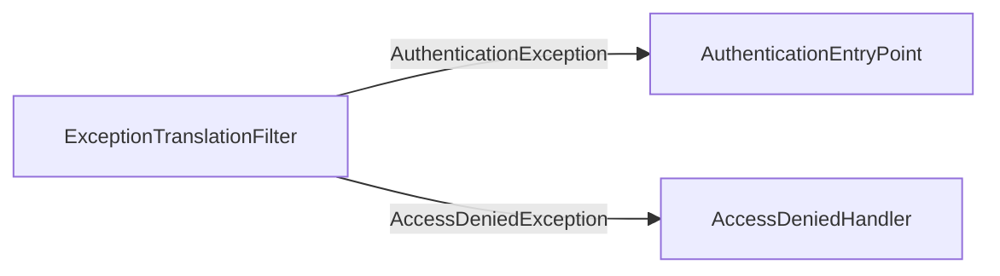

# Spring Security Exception Process

This document illustrates how Spring Security routes and handles authentication and authorization
exceptions—showing how `ExceptionTranslationFilter` intercepts errors and delegates to the correct
handler to produce a 401 or 403 response.

## Components

### ExceptionTranslationFilter

Intercepts any downstream `AuthenticationException` or `AccessDeniedException` and routes it to the
correct handler.

### AuthenticationEntryPoint

Handles authentication failures (e.g. missing or invalid credentials) by initiating an
authentication scheme (such as HTTP Basic) and returning a **401 Unauthorized** response.

### AccessDeniedHandler

Handles authorization failures when an authenticated user lacks sufficient permissions, returning a
**403 Forbidden** response.