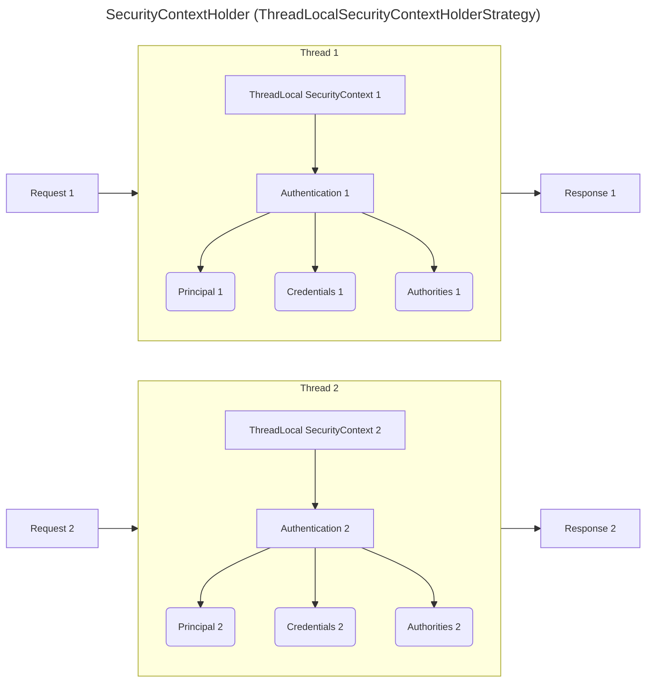

# SecurityContext & SecurityContextHolder

Spring Security needs a way to associate an authenticated user with each thread handling a request.
It does this by storing a `SecurityContext`—which wraps a single `Authentication` object—in a
thread-local holder (`SecurityContextHolder`). This lets any code on that thread call
`SecurityContextHolder.getContext().getAuthentication()` to find out “who” is running. At the end of
the request, Spring clears the context to prevent data leaking into other requests.
---

## Core Concept

### 1. SecurityContext

- Holds security data for one “execution context” (typically a single HTTP request thread).
- Contains exactly one Authentication (principal, credentials, authorities).

### 2. SecurityContextHolder

- Static façade whose methods delegate to a `SecurityContextHolderStrategy`.
- By default, Spring uses a `ThreadLocalSecurityContextHolderStrategy`, so each thread has its own
  SecurityContext.
- Static methods (`getContext()`, `setContext(...)`, `clearContext()`) actually read/write that
  thread’s
  ThreadLocal storage.

---

## How does it Work in a Web Request?

### Default (ThreadLocal) Behaviour

#### 1. Start of HTTP Request (`SecurityContextPersistenceFilter`)

- Looks in the `HttpSession` for an existing `SecurityContext`.
- If found, loads it into the thread’s `ThreadLocal`; otherwise, creates a fresh
  empty `SecurityContext`.

#### 2. Authentication Phase

When a request reaches Spring Security’s authentication filter (e.g.,
`UsernamePasswordAuthenticationFilter`), the filter extracts credentials (username/password, token,
etc.) and passes them to an `AuthenticationManager`. If authentication succeeds, an Authentication
object (containing principal, authorities, etc.) is returned.

Spring then calls `SecurityContextHolder.getContext().setAuthentication(authResult);` so that
downstream code (controllers, services) can retrieve the authenticated user
via `SecurityContextHolder.getContext().getAuthentication();`. Or, have your components accept
an `Authentication` argument directly—Spring will populate it
automatically.

#### 3. End of HTTP Request (`SecurityContextPersistenceFilter`)

- Save as (possibly updated) `SecurityContext` back into the `HttpSession` (if session-based).
- Calls `SecurityContextHolder.clearContext()` to remove it from the thread's `ThreadLocal`,
  preventing leaks.

### Derived Behaviour

There are several options. Here we briefly introduce `InheritableThreadLocal` mode.

- If you need child threads (e,g, an async task) to inherit the parent's context, you can
  set `SecurityContextHolder.setStrategyName(SecurityContextHolder.MODE_INHERITABLETHREADLOCAL)`
- New threads will start with a snapshot of the parent's `SecurityContext`. Changes made later in
  the parent do not flow automatically to the child.